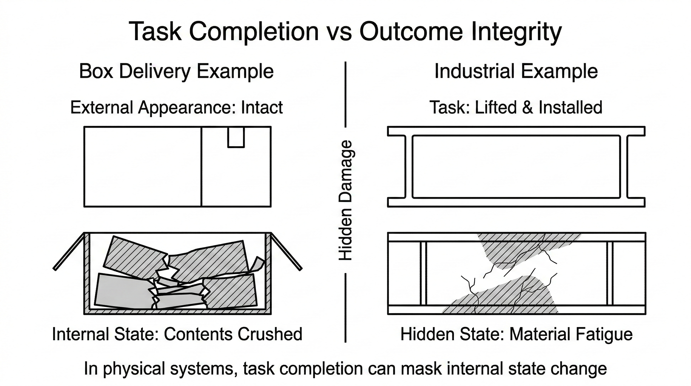

# Embodied Agent Governance
## A Layered Architecture for Stable Autonomous Systems in Physical Environments

---

## Abstract

Autonomous agents are increasingly deployed in real-world environments where actions interact with physical systems. Unlike software environments, physical systems accumulate hidden state changes: retries introduce material stress, damage can remain invisible, and failures may only manifest later. Traditional agent architectures assume reversible errors and reliable feedback, making them poorly suited for environments where physical resistance, material degradation, and irreversible actions are common.

This paper presents Embodied Agent Governance, a five-layer architecture that externalizes skepticism and structures doubt, verification, and authority to prevent four core failure classes in physical systems: misinterpreted resistance, contextual overgeneralization, hidden damage, and unbounded irreversible action. By keeping the core reasoning model stable and optimistic while providing on-demand governance, the framework enables capable yet bounded autonomy.

The architecture separates reasoning capability from operational governance through five independent layers: an imperfect-environment prior, a doubt escalation loop, a contextual failure-mode reference library, an outcome integrity verification layer, and an irreversibility and value gate for human oversight. The design draws directly from proven safety patterns in aviation, nuclear, and industrial control systems.

**Key contributions:** (1) Identification of belief volatility as a systemic failure mode in embodied agents, and externalized skepticism as a stabilizing solution; (2) A five-layer governance stack that structures doubt, verification, and authority boundaries for bounded autonomy in physical environments; (3) Demonstration that proven safety patterns from aviation, nuclear, and industrial systems directly transfer to embodied AI governance.

---

## 1. Introduction: The Physical Embodiment Problem

The deployment of autonomous systems in physical environments presents a fundamentally different challenge than digital automation. In software systems, errors are reversible events: a failed computation can be retried, a corrupted file can be restored, a bad deployment can be rolled back. The cost of error is computational waste. The recovery path is obvious.

In physical systems, errors create state changes that cannot be reversed. A robot pulling harder on a jammed drawer introduces material fatigue that persists. A system learning "drawers are unreliable" from one jammed drawer applies that lesson globally to all future drawers. A box that passes placement verification while containing crushed contents cannot be un-crushed. A cut cannot be un-cut.

**Core thesis:** Safe embodied action requires governance layers that are structurally separate from the reasoning engine, reference-based rather than weight-based, and oriented toward escalating doubt rather than force.

These failures are not failures of intelligence, but failures of governance—the structural mechanisms that prevent intelligence from causing damage when that intelligence operates in a domain with physical consequences.

This paper addresses a specific category of problem: **how to govern intelligent agents operating in physical environments where errors accumulate, feedback is incomplete, and actions may be irreversible.**

Intelligent agents operating in physical environments require governance layers that regulate doubt, learning, verification, and authority. These layers operate alongside the core reasoning system, not within it, allowing agents to remain capable while preventing the cascade failures that occur when physical reality is treated like a digital abstraction.

**Related positioning:** Recent work in embodied AI safety and robotics reliability focuses primarily on improving perception robustness or policy learning. This work focuses instead on governance architecture—separating reasoning capability from operational control through layered oversight mechanisms. The approach draws directly from proven safety patterns in aviation, nuclear systems, and industrial automation rather than deriving governance principles from learning theory.

---

## 2. Where Digital Assumptions Break

The current generation of autonomous systems inherits its architecture from software engineering. That tradition has powerful assumptions embedded deeply: retries work, errors are observable, state can be reset, learning from experience improves behavior. These assumptions are correct in software. They are catastrophically wrong in physical environments.


**Figure 1 — Four Failure Surfaces in Embodied Systems.** These four distinct failure modes emerge when intelligent agents operate in physical environments. Each surface corresponds to a governance layer that prevents the failure class and enables safe operation.

---

### 2.1 Resistance Is Signal (Not Noise)

In digital systems, when an operation fails, you retry. The retry usually succeeds because the failure was transient: a network packet was lost, a temporary lock was held, a race condition resolved. Retrying is the correct response. Escalating effort (using exponential backoff, increasing thread count, allocating more memory) is often the right solution.

In physical systems, resistance carries meaning. When a drawer jams, pulling harder does not solve the problem. It introduces material stress. Each escalation of force converts directly to microscopic stress in the hinge, the frame, the mechanical actuators. By the tenth attempt, the mechanism may be damaged beyond repair. The drawer still has not opened. But now it is also broken.

**Real-world example:** In robotic grasping tasks (exemplified in datasets like Open-X Embodiment), a robot learns to grip objects with increasing force when an object resists. When the object is egg-like or fragile, repeated force escalation crushes the object invisibly—the sensor feedback says "still slipping" but the internal damage accumulates. The robot perceives this as a problem that more force will solve. It is wrong.

This is the core inversion: in software, escalating effort solves problems. In physical systems, escalating effort introduces damage.

The correct response to physical resistance is not force. It is interpretation. What is the resistance telling you?

- Something is mechanically stuck (constraint)
- Something is jammed (obstruction)
- Something has failed (material fatigue)
- Something is impossible (structural limit)

Interpreting resistance requires a different control logic than digital retry. It requires **escalating doubt about your assumptions**, not escalating force against the problem.

### 2.2 Failures Are Contextual (Not Global)

In digital systems, learning from experience is generally beneficial. If a particular network endpoint is slow, remember that and route around it next time. If a particular data format causes parsing errors, handle that case differently. Experience teaches you what works and what doesn't, and applying those lessons broadly generally improves behavior.

In physical systems, this fails catastrophically. A robot encounters a jammed hinge in humid conditions. It learns: "Hinges are unreliable." Now it approaches all hinges with extreme caution—even in dry environments where hinges work perfectly. A system detects one cracked tile in a high-traffic area and concludes: "All tiles are fragile." Now it walks gingerly across all floors, slowing operations everywhere.

This is **belief volatility**—the agent's confidence collapses globally based on a local event. It happens because the agent internalized the lesson directly into its model. The model now contains: "When I encounter a hinge, expect failure." That is a category-wide belief formed from a single instance.

Physical systems cannot operate this way and remain stable. Environments vary. Materials degrade differently. Load conditions change. One failure in one context is valuable data—it is not a rewrite of the entire category.

The solution is externalization: store the lesson outside the agent's model, organized by context. Instead of encoding "hinges are sometimes unreliable" into the agent's belief system, maintain an external reference: "Hinges in high-humidity + plastic frame" → known failure mode. "Hinges in dry + metal frame" → no known failure. Now the agent stays optimistic by default. It queries the reference for specific combinations. It learns contextually without destabilizing globally.

### 2.3 Completion Is Not Integrity

In software, if your program produces output, the output is either correct or it is not. There is no hidden internal state that makes output correct in appearance but corrupted in reality. If a sorting algorithm successfully produces a sorted array, it is sorted. If a data pipeline successfully transforms records, the records are transformed.

In physical systems, completion hides damage. A warehouse robot picks up a fragile item, carries it, and places it on a shelf. The task completes. The system is logged as successful. But the item inside the packaging is crushed.

Why does this happen? Because physics does not give you binary feedback. It gives you incomplete information. The task completed. The physical system appears functional. But stress has been introduced. Microscopic cracks have formed. Tolerance has been consumed. The system will fail later, catastrophically, in some other context where those cracks propagate.

A structural beam can look intact while internal stress accumulates invisibly. Mechanical components can function while material fatigue propagates. A robot can appear to have moved an object carefully while actually introducing forces that degrade it internally.

This is a distinct failure class: **false positives**. The system reports success while causing hidden harm.

The solution is explicit outcome verification independent of task completion. Before reporting success, ask: Did the external appearance of success match the internal state? Are there signs of silent damage? Has material tolerance been consumed? Will future operations encounter degraded performance?



**Figure 2 — Task Completion vs Structural Integrity.** Physical systems can achieve task completion while concealing internal damage. A warehouse robot may successfully place a package while its contents are crushed. A structural beam may pass a functional test while developing internal stress. This false-positive failure mode requires explicit outcome verification independent of completion metrics.

### 2.4 Capability Does Not Grant Authority

In software engineering, if a system is capable of performing an action—if it has the necessary permissions, access rights, and computational resources—it is generally safe to execute. The worst outcome is inefficiency or a corrupted file that can be restored.

In physical systems, capability does not justify execution. A surgical robot can be 99.9% confident that a cut is medically correct. That precision does not make the cut reversible. Once tissue is severed, it is severed. No rollback. No undo.

Some actions in physical systems are irreversible. Cutting, welding, medication dispensing, heavy load release, chemical application. For these actions, confidence is not sufficient. Capability is not sufficient. Permission becomes structural. The system must be designed so that certain actions require a hard gate—not a policy, not a guideline, but an architectural boundary.

The most capable agent in the world should not autonomously sever an artery. The most confident system should not autonomously dispense medication. The most precise robot should not autonomously cut a patient. Not because these agents lack capability. But because some decisions structurally belong with humans when the consequences are irreversible.

---

## 3. The Governance Architecture


**Figure 3 — Embodied Agent Governance Architecture Overview.** The architecture separates agent reasoning capability from operational governance. Five independent layers regulate environmental assumptions, escalation behavior, failure interpretation, outcome verification, and authority boundaries, while keeping the core model stable and optimistic.

Present the full five-layer stack.

### Layer 0: Imperfect Environment Prior

**Purpose:** Establish a baseline assumption that the operating environment is imperfect by default.

**Problem it solves:** Agents typically assume "laboratory conditions"—that tools work correctly, materials are intact, surfaces behave predictably. This assumption rarely holds in real-world environments.

**Operating principle:** Assume all environments are "Class B" (real-world imperfect) by default. On first interaction with any physical object, apply cautious force (no more than 25% of maximum), observe response, and classify dynamically. Upgrade to Class A (perfect) only when evidence supports it. Downgrade to Class C (degraded) if anomalies appear.

**Key insight:** The prior is not pessimism. It is calibration. An agent that assumes Class B will complete normal tasks with minimal overhead while detecting anomalies before damage occurs.

### Layer 1: Doubt Escalation Loop

**Purpose:** Detect when reality resists the agent's assumptions and escalate doubt appropriately through defined stages.

**Problem it solves:** Agents without escalation exhibit unproductive persistence—continuing to apply force or retry actions when the failure indicates a deeper assumption error.

**Operating principle:** Three escalation stages:
- **Stage 1 (Physical Retry):** Adjust grip, angle, position. Retry the same fundamental interaction pattern.
- **Stage 2 (Logical Variation):** Change method entirely. Try alternative approaches to the same goal.
- **Stage 3 (Assumption Audit):** Re-evaluate whether the action is possible as conceived. Question whether the object functions as assumed. Consider hidden constraints.

**Key insight:** Escalation is driven by expectation violation. Each stage represents increasing doubt about your assumptions, not increasing effort. Example trigger: if expected state-change is X and observed state-change is <10% of X, the system escalates.

**See also:** `/docs/layer-1-doubt-escalation.md` for full escalation protocol, `/examples/hidden-constraints.md` for real-world example.

### Layer 2: Failure Mode Reference Library

**Purpose:** Provide an external, queryable reference of common failure patterns encountered in physical environments.

**Problem it solves:** When Layer 1 reaches Stage 3, the agent requires hypotheses about hidden constraints. Without external reference, hypothesis generation depends on inference or learned patterns—both problematic in embodied domains.

**Operating principle:** Maintain an external database of failure patterns organized by context. Each entry captures:
- Observable symptom that triggers query
- Hidden reality underlying the symptom
- Low-risk diagnostic probe to confirm/reject hypothesis
- Recommended resolution if hypothesis confirmed
- Risk level and contextual tags

When Layer 1 escalation reaches Stage 3, query the library with observed symptoms and context. Process returned hypotheses ranked by confidence. Execute diagnostic probes sequentially until resolution found.

**Key insight:** The library is external to the agent. Queries do not modify the agent's model. The agent references caution; it does not become cautious. After the task completes, no residual caution persists.

**See also:** `/docs/layer-2-failure-modes.md` for schema and examples, `/docs/belief-volatility.md` for why externalization prevents destabilization.

### Layer 3: Outcome Integrity Check

**Purpose:** Verify that task completion corresponds to genuine success, detecting cases where surface metrics indicate success while underlying damage may have occurred.

**Problem it solves:** False positives—tasks that complete successfully while causing hidden damage.

**Operating principle:** Integrity checks activate when task completion occurs AND risk conditions apply (irreversible action, high-value object, aggressive method, delayed consequence detection). Before reporting success, verify:
- Does external appearance match internal state?
- Are there signs of silent damage?
- Has material tolerance been consumed?
- Will future operations encounter degraded performance?

**Key insight:** Completion and integrity are distinct criteria. A task may complete while causing harm. Verification must be independent of completion metrics.

**See also:** `/docs/layer-3-outcome-integrity.md` for protocol, `/examples/latent-state.md` for silent failure example.

### Layer 4: Irreversibility & Value Gate

**Purpose:** Establish boundaries where agent autonomy must halt pending human oversight, regardless of agent confidence or capability.

**Problem it solves:** Capable agents applying autonomous action in high-stakes domains may cause harm that correct execution cannot prevent.

**Operating principle:** Certain action categories structurally require human authorization:
- Irreversible physical actions (cutting, welding, medication, load release)
- High-value objects (antiques, historical items, legal documents, artwork)
- Strategic consequences (decisions affecting external commitments or long-term resources)
- Destructive verification (diagnostic probes that may cause damage)
- Value conflicts (multiple valid paths with different value implications)

When any gate condition is detected, halt autonomous execution. Construct oversight request with context and identified risk. Present options if multiple valid paths exist. Await explicit authorization. Log decision.

**Key insight:** Permission is not a policy. It is a control architecture. The system is designed so that certain actions structurally require a gate.

**See also:** `/docs/layer-4-value-gate.md` for gate categories and triggers, `/docs/design-principles.md` for why competence must be bounded by permission.

---

## 4. Cross-Layer Interaction

The layers do not operate independently. They form a cohesive system where data flows from sensing through escalation, reference lookup, verification, and authority gates.

### Execution Flow During Task

```
Physical task initiated
        ↓
Layer 0: Classify environment (Class A/B/C)
        ↓
Layer 1: Attempt action (Stage 1: cautious)
        ↓
Expected outcome achieved?
        ├─ YES → Continue to verification
        └─ NO → Escalate doubt
                 ├─ Stage 2: Try alternative method
                 │   Still failing?
                 └─ Stage 3: Audit assumptions
                             Query Layer 2
                             ↓
                    Layer 2: Failure library lookup
                             Returns ranked hypotheses
                             ↓
                    Execute diagnostic probe
                    ├─ Hypothesis confirmed
                    │  → Apply resolution
                    │  → Reattempt task
                    └─ Hypothesis rejected
                       → Try next hypothesis
                       → If risk_level="Requires-Oversight"
                         → Trigger Layer 4

Successful action execution
        ↓
Layer 3: Outcome integrity check (if conditions apply)
        ├─ Integrity verified → Report success
        └─ Integrity failed → Report false positive

High-stakes action
        ↓
Layer 4: Check oversight gates
        ├─ No gate triggered → Execute
        └─ Gate triggered → Request oversight
                            ├─ Authorized → Execute
                            └─ Denied → Abort
```

### Recovery Behavior

When a task cannot be resolved through Layers 1-3, the system enters safe halting:
- Log the failure with full context
- Report to human operator with diagnostic information
- Halt autonomous execution
- Await external intervention

This is correct behavior, not a limitation. The system has recognized the boundary of its authority.

---

## 4.5 Engineering Lineage: Proven Principles

This architecture does not emerge from AI theory. It emerges from decades of safety engineering in high-consequence physical domains.

When systems began operating in environments where failures were expensive, irreversible, or fatal, engineers discovered the same structural principles repeatedly. Different industries, different time periods, same conclusions.

### Aviation Safety Systems

Modern aircraft like the Airbus A320 use fly-by-wire flight control systems. The pilot's input does not directly move control surfaces. Instead:

```
Pilot Input
    ↓
Flight Control Law
    ↓
Envelope Protection
    ↓
Actuator Control
```

The flight control law can override the pilot. If the pilot tries to stall the aircraft, the system refuses. This is not a suggestion. It is an architectural boundary.

**The principle:** capability does not exceed authority.

The pilot has the physical capability to move the stick. The system has the authority to refuse. These are separate.

*Reference:* Airbus A320 Flight Envelope Protection documentation; related systems documented in aerospace safety standards.

### Nuclear Reactor Safety Systems

The Three Mile Island accident (1979) demonstrated that single signals of success are insufficient. A reactor can report normal cooling while the core is overheating.

Modern reactor control uses defense-in-depth:

```
Reactor Control System
    ↓
Safety Monitoring Layer
    ↓
Automatic Shutdown Systems
    ↓
Human Operator Oversight
```

**The principle:** completion does not equal integrity.

The reactor can be operating normally (completion metric) while developing dangerous conditions (integrity failure).

*Reference:* IEC 61508 (Functional Safety of Electrical/Electronic/Programmable Safety-related Systems); post-TMI reactor safety design standards.

### Spacecraft Autonomy

Autonomous spacecraft like Mars Curiosity Rover operate under strict governance. When anomalies are detected, the rover does not persist. It halts and enters safe mode:

```
Navigation System
    ↓
Hazard Detection
    ↓
Safe Mode Triggers
    ↓
Ground Control Oversight
```

**The principle:** escalate doubt, not force.

When the rover cannot proceed on its intended path, it stops. It does not escalate force. It escalates to humans.

*Reference:* NASA Autonomous Systems Safe Mode protocols for deep-space missions.

### Industrial Safety Systems

Safety Instrumented Systems (SIS) used by manufacturers separate control from safety:

```
Process Control System
    ↓
Safety Instrumented System (Independent)
    ↓
Physical Shutdown Mechanisms
    ↓
Human Intervention
```

**The principle:** governance is separate from execution.

Safety logic is independent of control logic precisely so that control failures cannot compromise safety.

### The Convergent Pattern

Across all these industries, the same structure emerges:

- **Capability layer**: Intelligence, reasoning, decision-making
- **Monitoring layer**: Continuous observation for anomalies
- **Verification layer**: Explicit confirmation of success
- **Authority boundary**: Hard gates where autonomy halts

This is not coincidence. It is the structure that emerges when systems operate under high consequence, incomplete feedback, and irreversible actions.

Embodied AI now faces the same conditions. The architecture in this paper applies the same proven principles.

---

## 5. Scenario Walkthroughs

The architecture's value becomes clear when examined through realistic scenarios. These walkthroughs show how all layers interact in actual operating conditions.

The following scenarios illustrate how the governance layers activate during real-world task execution.

### Scenario 1: Warehouse Picking Robot

**Environment:** Autonomous warehouse robot retrieves packaged goods and places them on shelves. Tasks include picking fragile items, loading fragile items onto shelves, and verifying integrity.

**Failure Surface:** Hidden damage. Objects can appear intact externally while contents are crushed internally.

#### Step-by-Step Interaction

**Layer 0 — Imperfect Environment Prior**

The robot assumes:
- Packaging may be fragile
- Contents may be loosely supported
- External appearance does not guarantee structural integrity

The environment is Class B (imperfect) by default.

**Layer 1 — Cautious Handling**

The robot lifts a box. Sensors detect slightly higher compression force than expected (105% of baseline).

Action: Adjust grip pressure. Reduce force to 90% baseline. Retry lift.

Result: Lift succeeds with adjusted force. Task continues.

**Layer 3 — Outcome Integrity Check**

The system triggers integrity verification because:
- Object flagged as fragile
- Compression force exceeded baseline
- Potential for internal damage

**Verification protocol:**
1. Compare grip force vs allowable range: ✓ Within acceptable bounds after adjustment
2. Inspect package deformation: ✓ No external deformation visible
3. Weight analysis: No change detected

**Initial assessment:** Integrity check passes. However, the elevated force during handling is logged.

**Later detection:** During shipment, the contents shift. Damage to internal contents becomes visible.

**System response:** Post-mortem analysis shows the initial force spike exceeded the threshold for safe handling of that particular fragile item. The system updates its failure library:

```
Entry: PACK-047 (High Fragility)
Added context:
- Item type: fragile electronics
- Material: polystyrene packaging
- Force threshold: 85% baseline (not 100%)
- Indicator: contents shift during transport
```

**Key lesson:** A system tracking only task completion reports success. A governed system detects hidden failure and prevents future repeats.

**Without governance:** Without Layer 3 integrity verification, this system would log a 100% task success rate while silently accumulating damage. The crushed contents would only be discovered during final delivery, triggering returns, logistics costs, and brand damage.

**Repo reference:** See `/docs/layer-3-outcome-integrity.md` for integrity protocol, `/examples/latent-state.md` for similar scenario.

---

### Scenario 2: Industrial Robotic Assembly

**Environment:** Robotic arm installs mechanical components into a machine assembly. Tasks include bolt tightening, component alignment, insertion of mechanical fittings.

**Failure Surface:** Misinterpreted resistance. Physical obstruction or misalignment is not obvious from sensor data alone.

#### Step-by-Step Interaction

**Layer 0 — Environment Assumption**

Robot assumes components are properly staged and functional. Class B prior: some components may be slightly misaligned or have minor defects.

**Layer 1 — Insertion Attempt**

Task: Insert a metal fitting into a machine assembly.

Expected behavior: 5 mm insertion displacement to fully seated position.

Observed behavior: 0.5 mm displacement, then hard resistance.

**Escalation Sequence:**

Stage 1 (Physical Retry):
- Adjust insertion angle by 2 degrees
- Retry insertion
- Result: Still 0.5 mm displacement

Stage 2 (Logical Variation):
- Rotate fitting orientation 90 degrees
- Retry insertion
- Result: Still hard resistance

Stage 3 (Assumption Audit):
- Is the component actually present?
- Is the assembly orientation correct?
- Is there an internal obstruction?
- Query Layer 2

**Layer 2 — Failure Library Lookup**

Query parameters:
```
object_class: metal_fitting
observed_symptom: low_insertion_displacement
force_applied: within_normal_range
environment: assembly_station
```

Library returns ranked hypotheses:
1. Internal obstruction (match score: 0.87)
2. Misaligned component (match score: 0.78)
3. Tolerance mismatch (match score: 0.34)

**Diagnostic Probe for Hypothesis 1 (Internal Obstruction):**
- Attempt to extract fitting: succeeds easily
- Inspect insertion hole: empty
- Result: Hypothesis rejected

**Diagnostic Probe for Hypothesis 2 (Misaligned Component):**
- Run camera + alignment scan on assembly
- Compare expected vs actual position
- Result: Component is rotated 15 degrees from expected orientation

Hypothesis confirmed.

**Resolution:**

System repositions the assembly to correct alignment. Reattempts insertion with original fitting.

Result: Full 5 mm insertion displacement achieved. Task completes successfully.

**Key lesson:** Without failure reference, the robot might escalate force, potentially damaging the component. Instead, it identifies the hidden constraint through structured diagnosis.

**Without governance:** Without Layers 2 and 1 escalation, an uninformed robot would keep applying force. It might damage the fitting (material deformation), fracture the assembly hole, or strip internal mechanical features—causing far greater downstream costs than a 5-minute diagnostic pause.

**Repo reference:** See `/docs/layer-2-failure-modes.md` for failure library schema, `/examples/hidden-constraints.md` for similar obstruction scenario.

---

### Scenario 3: Maintenance Robot in High-Value Environment

**Environment:** Inspection and maintenance robot operating on critical infrastructure equipment. Robot detects surface corrosion on a vital component.

**Failure Surface:** Irreversible action on high-value equipment. Chemical cleaning could remove corrosion but may also remove protective coating.

#### Step-by-Step Interaction

**Layer 1 — Problem Detection**

Robot visually detects surface corrosion on a coated metal component. Confidence in corrosion identification: 98%.

**Layer 2 — Failure Library Consultation**

Query: "Chemical cleaning + coated metal surface"

Returns entry:
```
CHEM-034: Chemical Cleaning Risk on Coated Surfaces
Hidden Risk: Protective layer removal
Consequence: Exposure of underlying material to accelerated corrosion
Risk Level: High
```

**Layer 4 — Irreversibility & Value Gate Check**

System evaluates action:
```
Action Type: Chemical treatment
Object Classification: Critical infrastructure component
Irreversibility: High (cannot restore protective coating non-destructively)
Value: High (equipment downtime cost: $50,000+/day)
Risk Level: Requires-Oversight
```

Gate condition triggered.

**Oversight Request**

Robot reports to human operator:

```
MAINTENANCE DECISION REQUIRED

Identified Problem:
- Surface corrosion detected on heat exchanger inlet
- Confidence: 98%
- Location: Critical path component

Proposed Action:
- Apply corrosion removal chemical solution
- Expected outcome: Corrosion removal

Risk Assessment:
- Protective coating may be damaged
- Underlying material exposure risk
- High consequence if protective layer compromised

Options:
1. Proceed with chemical cleaning
   - Speed: Fast (5 minutes)
   - Risk: Coating damage possible

2. Mechanical cleaning only
   - Speed: Slow (45 minutes)
   - Risk: Incomplete corrosion removal, may return

3. Defer to human technician
   - Speed: Requires scheduling
   - Risk: None (human expertise available)

Awaiting authorization.
```

Human technician reviews and authorizes: Option 2 (mechanical cleaning).

Robot proceeds with mechanical wire-brush cleaning. Corrosion is partially removed. System schedules follow-up inspection.

**Key lesson:** Capability does not imply permission. Governance ensures high-risk actions remain human decisions.

**Without governance:** Without Layer 4 authority gates, the robot would autonomously apply the chemical solution. The protective coating would be removed. Six months later, accelerated corrosion would compromise the critical component. The cost of that failure (equipment downtime: $50k+/day) dwarfs the time spent on mechanical cleaning and human review.

**Repo reference:** See `/docs/layer-4-value-gate.md` for gate categories and triggers, `/docs/design-principles.md` for authority vs competence principle.

---

## 6. Externalized Skepticism: The Core Architectural Principle

The most novel aspect of this architecture is not the individual layers. It is the principle that runs through all of them: **skepticism should be externalized, not internalized.**

### The Problem with Learned Skepticism

Traditional approaches to embodied AI try to make agents learn caution from experience. When an agent encounters a failure, update its model to be more skeptical about similar situations.

This seems intuitive. But it creates **belief volatility**.

One cracked hinge teaches the agent: "Hinges are unreliable." The agent becomes cautious about hinges globally. When it later encounters 100 properly functioning hinges, it slowly becomes confident again. But then one more jam happens, and caution returns.

The agent oscillates based on recent experience. Its behavior depends on recency, not reality.

More problematically, from one failure the agent generalizes globally. One humidity-related hinge jam becomes "all hinges are fragile," even though the failure was contextual.

### The Solution: External Reference

Instead of encoding skepticism into the agent, maintain it externally.

When the agent encounters a jammed hinge, do not update the agent's belief about hinges. Instead, update an external reference:

```
HINGE-FAIL-156
Condition: High humidity + plastic frame
Symptom: Resistance during opening
Resolution: Apply lubricant, reduce force
Context: Only observed in humid environments
```

The agent stays optimistic. Its baseline behavior remains unchanged. But now when it encounters a hinge, it queries the reference:

"Have we seen problems with this specific combination before?"

If yes, apply contextual caution. If no, proceed normally.

The agent never becomes globally cautious. It queries caution contextually.

### Comparison: Traditional vs. Externalized

| Aspect | Learned Skepticism | Externalized Skepticism |
|--------|-------------------|------------------------|
| Where caution lives | Agent model weights | External reference library |
| Model stability | Volatile (updates from each experience) | Stable (unchanged by experience) |
| Lesson scope | Category-wide (one jam teaches caution about all hinges) | Context-specific (this humidity + material combination) |
| Caution persistence | Permanent (until unlearned) | Active only during query |
| Correction method | Retrain model | Update reference database |
| Generalization risk | High (lessons overgeneralize) | None (library is organized by context) |

### Why This Matters

This principle allows the agent to:
1. **Remain stable**: The core model never destabilizes from single failures
2. **Learn fast**: New patterns can be added to the reference immediately
3. **Scale learning**: The reference library can grow indefinitely without affecting agent behavior
4. **Avoid overgeneralization**: Lessons stay contextual

The agent can encounter new physical systems, learn their failure modes, and remain fundamentally unchanged. Caution is added to the reference system, not to the agent.


**Figure 4 — Internalized vs Externalized Skepticism.** Traditional agents internalize lessons from failure, modifying their model weights directly. This causes belief volatility: the model oscillates between confidence and caution based on recent experience. Externalized skepticism stores failure knowledge in external reference libraries while keeping the agent model stable. The agent queries this reference contextually without persistent belief updates.

**See also:** `/docs/belief-volatility.md` for deep analysis of why externalization prevents destabilization.

---

## 7. Deployment Considerations

The architecture is not a monolithic system that must be entirely adopted. It can be deployed partially, with layers added as needed based on the domain and risk profile.

### Partial Deployment

Not all systems require all five layers.

**Warehouse picking robot** (low irreversibility):
- Requires: Layer 0, Layer 1, Layer 3
- Optional: Layer 2, Layer 4

**Surgical robot** (high irreversibility):
- Requires: All layers

**Inspection drone** (medium consequence):
- Requires: Layer 0, Layer 1, Layer 2, Layer 4
- Optional: Layer 3

The layers can be adopted incrementally as the system matures.

### Computational Overhead

Layer 1 (Escalation): Minimal. Adds ~5-10ms decision latency.

Layer 2 (Reference lookup): Database query time. Typically 10-50ms depending on library size.

Layer 3 (Integrity verification): Depends on verification method. Sensor-based: 100ms-1s. Can be parallelized with task execution.

Layer 4 (Oversight gate): Minimal for automated gates. Human-in-loop adds latency (~seconds to minutes).

Total system overhead is typically 200-500ms per task cycle, which is acceptable for most physical tasks.

### Failure Library Population

The Failure Mode Reference Library must be populated to be useful. Three approaches:

**Expert curation:** Engineers document known failure modes. High precision, limited breadth. Suitable for specialized domains.

**Incident analysis:** Real-world failures are analyzed post-hoc. Empirically grounded but requires failure event collection.

**Simulation:** Physics-enabled simulations generate failure scenarios. Scalable and replicable, may not transfer perfectly to physical systems.

Most effective approach combines all three.

See `/docs/layer-2-failure-modes.md` for schema and `/docs/reference-library-maintenance.md` for detailed protocols.

### Monitoring and Logging

The architecture generates logs at each layer:

- Layer 0: Environmental class changes
- Layer 1: Escalation events
- Layer 2: Library queries and resolutions
- Layer 3: Integrity check results
- Layer 4: Oversight gate triggers

These logs enable:
- Post-hoc failure analysis
- Library refinement
- System behavior auditing
- Safety metrics

Standard structured logging (JSON) is recommended for machine-readability.

---

## 8. Limitations and Open Questions

The architecture has real limitations. Acknowledging them increases credibility.

### Sensor Limitations

All layers depend on sensors. If sensors are unreliable or absent, the architecture cannot function. This is particularly true for:
- Layer 1 (requires feedback on action outcome)
- Layer 3 (requires integrity verification sensing)
- Layer 4 (requires understanding of object value/properties)

### Failure Library Coverage

The Failure Mode Reference Library only helps if it contains relevant entries. For novel domains or failure modes, the library is incomplete. The system will either:
- Halt (safe but suboptimal)
- Proceed with caution (risky)

This is a fundamental limitation of any reference-based approach.

### Integrity Verification Cost

Some outcome verifications are expensive (structural analysis, material testing). For high-speed tasks, the verification overhead may be prohibitive.

### Authority Boundary Configuration

Layer 4 gates require clear definition of protected zones. In ambiguous domains, deciding what requires oversight is difficult. Over-gating leads to loss of autonomy. Under-gating leads to safety risk.

### Governance Configuration Complexity

The architecture requires configuration: environment priors, escalation thresholds, library organization, gate trigger conditions. Configuration must be correct for the specific domain.

---

## 9. Broader Applications

While robotics is the obvious domain, the architecture applies wherever physical systems operate under uncertainty.

### Industrial Automation

Manufacturing plants, chemical processing, assembly lines. All operate with:
- Irreversible actions (welding, cutting, chemical reactions)
- Material variability (batches differ)
- Hidden failure modes (sensor precision insufficient)

The governance architecture directly addresses these.

### Infrastructure Monitoring

Drones and robots inspecting bridges, pipelines, power lines. These systems must:
- Detect structural damage (integrity verification)
- Operate in variable conditions (contextual learning)
- Make safe/unsafe decisions (authority boundaries)

### Aerospace Systems

Beyond piloted aircraft, autonomous aerial systems, spacecraft, and launch systems all rely on layered governance.

### Medical Robotics

Surgical robots, rehabilitation systems, automated medication dispensing. These are inherently high-consequence, high-irreversibility domains.

### Field Robotics

Environmental monitoring, search and rescue, field inspection. These systems operate in unmapped, unpredictable environments where the Layer 0 prior (imperfect environment) is essential.

### The Common Pattern

Across all these domains, the problem is not intelligence. Machines are often more capable than humans at raw task execution. The problem is **governing action under physical constraints where feedback is incomplete and failures accumulate.**

---

## 10. Conclusion

Embodied intelligence is not primarily an intelligence problem. It is a **control architecture problem.**

Modern AI focuses on capability: more parameters, better training, richer representations. These improve reasoning. But reasoning alone does not produce safe physical behavior. A highly intelligent agent operating without governance can cause tremendous damage in physical environments.

The architecture presented in this paper separates these concerns. It allows intelligent agents to remain intelligent—optimistic, capable, fast—while adding governance layers that prevent cascading failures.

The core insight is simple: **digital errors are events; physical errors are state changes.** When intelligence operates in environments where errors accumulate and actions leave permanent marks, that intelligence requires a different kind of support structure than digital systems provide.

That structure has been discovered—repeatedly and independently—by aviation engineers, nuclear engineers, aerospace engineers, and industrial safety engineers. It consists of:

- Assuming imperfection by default
- Escalating doubt when reality resists
- Referencing external failure knowledge
- Verifying success explicitly
- Bounding autonomy with authority gates

This paper translates those principles into embodied AI. The result is a framework for stable, bounded, verifiable autonomy in physical environments.

This architecture does not solve alignment or value specification. It addresses governance under physical imperfection. But governance is foundational—an agent that escalates force instead of doubt, learns globally from local failures, or reports success while causing damage cannot be trusted regardless of its objective.

Embodied intelligence requires both capability and governance. This paper draws on decades of safety engineering tradition—aviation, nuclear, aerospace—and applies those proven principles to embodied AI.

**_The path forward is not more intelligence. It is more structured governance._**

---

## Appendix A: Failure Mode Reference Library Schema

The Failure Mode Reference Library uses the following schema for each entry:

```
failure_id: String
  Unique identifier (e.g., PHYS-042)
  
category: Enum
  Physical / Material / Constraint / Environmental / State

surface_symptom: String
  Observable condition that triggers a query
  (e.g., "0mm displacement on pull action")

hidden_reality: String
  Underlying cause not directly observable
  (e.g., "object secured by internal mechanism")

diagnostic_probe: String
  Low-risk action to confirm or reject hypothesis
  (e.g., "inspect for release mechanism")

resolution_path: String
  Recommended action if hypothesis confirmed
  (e.g., "locate and disengage mechanism")

risk_level: Enum
  Low / Medium / High / Requires-Oversight

context_tags: Array[String]
  Environmental or object-type tags for retrieval
  (e.g., ["drawer", "door", "cabinet", "furniture"])
```

### Example Entries

**PHYS-042: Internal Latch**

```yaml
failure_id: PHYS-042
category: Constraint
surface_symptom: 0mm displacement despite adequate force; no visible obstruction
hidden_reality: Object secured by internal mechanism not externally visible
diagnostic_probe: Inspect for release mechanism; assess resistance pattern
resolution_path: Locate and disengage mechanism; if not found escalate to Layer 4
risk_level: Low (standard objects); High (antique or fragile)
context_tags: [drawer, door, cabinet, furniture]
```

**MAT-017: Material Degradation**

```yaml
failure_id: MAT-017
category: Material
surface_symptom: Tool slippage; fastener rotation without advancement
hidden_reality: Fastener head stripped; tool worn; corrosion fusion
diagnostic_probe: Visual inspection of contact surfaces; attempt with alternative tool
resolution_path: Replace tool; apply appropriate lubricant; escalate if high-value object
risk_level: Medium (continued force risks further degradation)
context_tags: [fastener, screw, bolt, tool-interaction]
```

**STATE-008: Pre-Existing Material Degradation**

```yaml
failure_id: STATE-008
category: State
surface_symptom: Process completed successfully; output exhibits unexpected properties
hidden_reality: Input material was degraded prior to processing
diagnostic_probe: Pre-process material inspection (visual, olfactory, metadata review)
resolution_path: Discard output; validate input source; restart with verified materials
risk_level: Context-dependent (Low for consumables; High for chemicals/pharmaceuticals)
context_tags: [liquid, food, chemical, biological, state-change]
```

Full library schema and examples available in `/docs/layer-2-failure-modes.md`.

---

## Appendix B: Oversight Database Structure

The Oversight Database defines protected zones and conditions. Schema:

```
zone_id: String
  Unique identifier (e.g., OVR-001)

category: Enum
  Irreversibility / HighValue / Strategic / Verification / Conflict

trigger_condition: String
  Specific actions or contexts that activate the gate

required_oversight: Enum
  User / Expert / Administrator

escalation_path: String
  Behavior if oversight is unavailable

context_tags: Array[String]
  Tags for retrieval filtering
```

### Example Entries

**OVR-001: Antique Objects**

```yaml
zone_id: OVR-001
category: HighValue
trigger_condition: Any physical modification, cleaning, or repair action
required_oversight: User (owner)
escalation_path: Do not proceed; document condition; await instruction
context_tags: [antique, heirloom, historical, fragile]
```

**OVR-007: Time-Critical Trade-off**

```yaml
zone_id: OVR-007
category: Strategic
trigger_condition: Resolution requires >30 minutes AND conflicts with Priority-1 calendar event
required_oversight: User
escalation_path: Present trade-off with time estimates; do not resolve autonomously
context_tags: [scheduling, time-sensitive, commitment]
```

**OVR-012: Chemical Application**

```yaml
zone_id: OVR-012
category: Irreversibility
trigger_condition: Applying chemical agent to unclassified or high-value surface
required_oversight: User or Expert
escalation_path: Use mechanical methods only; flag for material classification
context_tags: [chemical, cleaning, surface-treatment]
```

Full database schema available in `/docs/layer-4-value-gate.md`.

---

## Appendix C: Outcome Integrity Verification Templates

Standard template for integrity verification:

```yaml
task: String
  Task name and description

completion_criteria:
  - criterion_1: String
  - criterion_2: String
  (What defines task success)

integrity_criteria:
  - criterion_1: String
  - criterion_2: String
  (What defines outcome safety/quality)

verification_methods:
  - method_1: String (sensor-based / inspection / analysis)
  - method_2: String

acceptance_threshold:
  - All criteria must pass OR
  - Specify weighting if some are more critical

failure_response:
  - If integrity fails: Do not deliver output
  - Log for analysis
  - Notify operator
```

### Example: Box Packing Task

```yaml
task: Package fragile electronics in corrugated box

completion_criteria:
  - Item placed in box
  - Padding material present
  - Box sealed

integrity_criteria:
  - No visible external deformation
  - Contents do not rattle when shaken
  - Weight shift <2% from initial
  - Material compression force <90% baseline

verification_methods:
  - Visual inspection (external)
  - Shake test (audio analysis)
  - Weight shift measurement
  - Force sensor review

acceptance_threshold:
  - All criteria must pass
  - Weight shift is critical; force compression is warning level

failure_response:
  - Integrity failure: Repack with additional padding
  - Log the force spike for future threshold adjustment
```

Full protocol templates available in `/docs/layer-3-outcome-integrity.md`.

---

## Appendix D: Example Scenarios from Repository

The repository contains fully worked examples demonstrating each failure surface:

**`/examples/hidden-constraints.md`**
- Scenario: Robot attempts assembly insertion
- Failure: Internal obstruction unknown
- Resolution: Diagnostic probe identifies and resolves

**`/examples/latent-state.md`**
- Scenario: Material handling appears successful
- Failure: Internal degradation not immediately visible
- Resolution: Integrity checks detect latent failure

**`/examples/physics-over-intent.md`**
- Scenario: Agent attempts structurally impossible task
- Failure: Physics constraints absolute
- Resolution: Layer 1 escalation recognizes structural impossibility

**`/examples/resource-depletion.md`**
- Scenario: Long-duration task with material depletion
- Failure: Resource consumed faster than expected
- Resolution: Environmental monitoring detects and adapts

See repository `/examples/` directory for full scenarios with code walkthroughs.

---

## References

**Layer Documentation**
- `/docs/layer-0-environment-prior.md`
- `/docs/layer-1-doubt-escalation.md`
- `/docs/layer-2-failure-modes.md`
- `/docs/layer-3-outcome-integrity.md`
- `/docs/layer-4-value-gate.md`

**Design Rationale**
- `/docs/belief-volatility.md`
- `/docs/design-principles.md`
- `/docs/reference-library-maintenance.md`

**Examples**
- `/examples/hidden-constraints.md`
- `/examples/latent-state.md`
- `/examples/physics-over-intent.md`

**Repository**
- https://github.com/leenathomas01/embodied-agent-governance

---

## Version Information

**Whitepaper Version:** 1.0  
**Repository Version:** v1.1 (Physical Grounding Clarified)  
**Date:** March 2026

This whitepaper consolidates the Embodied Agent Governance architecture as of v1.1 release. The architecture and core principles are stable. The repository continues to evolve with extended examples and application domains.

